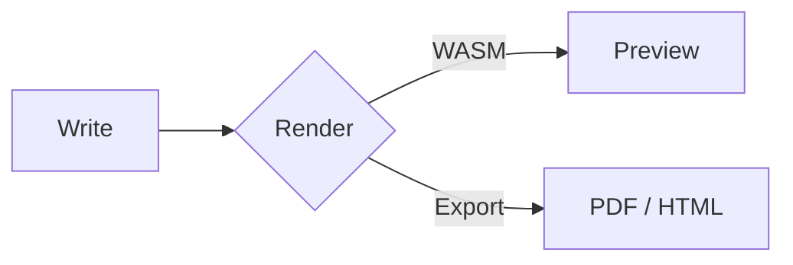
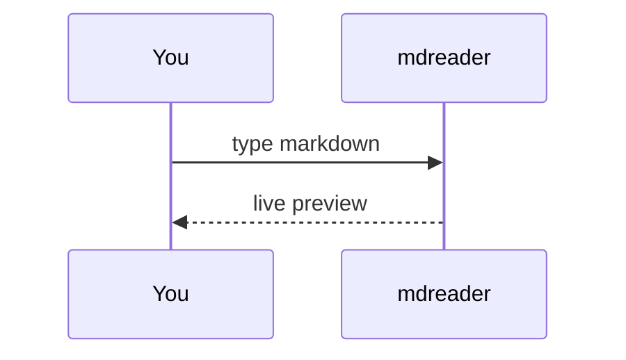

# Welcome to mdreader

A minimal, offline markdown workspace. Everything stays in your browser. This page shows every
syntax the renderer understands — edit it freely, it's just a file.

[[toc]]

## Text

**Bold**, *italic*, ***both***, ~~strikethrough~~, __underline__, ==highlight==,
`inline code`, H~2~O subscript, E = mc^2^ superscript, ||spoiler|| and emoji :rocket: :sparkles: :tada:.

Autolinks: https://commonmark.org and <mail@example.com>. A [relative link](#tables) jumps inside
the doc. A hard break ends this line\
and continues here.

## Links between notes

Wikilinks connect files: [[Welcome]] points back here, and [[My first note|this one]] doesn't exist
yet — click it in the preview to create it. Type `[[` in the editor to autocomplete file names. The
**Outline** tab in the sidebar shows headings and every file linking here.

## Lists

- Unordered item
  - Nested item
    - Deeper
1. Ordered
2. Items
   1. Nested ordered

### Tasks

- [x] Write the renderer
- [ ] Ship it
- [ ] Celebrate :partying_face:

## Tables

| Feature     | Status | Notes            |
| :---------- | :----: | ---------------: |
| GFM tables  |   ✅   | aligned columns  |
| Footnotes   |   ✅   | see below[^1]    |
| Math        |   ✅   | KaTeX            |
| **+ FP8**   |   ✅   | *bold in cells*  |

## Quotes & alerts

> A plain blockquote.
> > Nested quote.

> [!NOTE]
> Useful information users should know.

> [!TIP]
> Helpful advice for doing things better.

> [!IMPORTANT]
> Key information users need to know.

> [!WARNING]
> Urgent info that needs immediate attention.

> [!CAUTION]
> Advises about risks or negative outcomes.

>>>
A multiline block quote,
written without a `>` on every line.
>>>

## Code

```ts
// syntax highlighted
export function greet(name: string): string {
  return `Hello, ${name}!`;
}
```

```python
def fib(n: int) -> int:
    return n if n < 2 else fib(n - 1) + fib(n - 2)
```

```bash
echo "shell too" | tr a-z A-Z
```

## Math

Inline $e^{i\pi} + 1 = 0$ and display:

$$
\int_{-\infty}^{\infty} e^{-x^2}\,dx = \sqrt{\pi}
$$

```math
\begin{bmatrix} a & b \\ c & d \end{bmatrix}
```

## Diagrams





## Definition lists

Markdown
: A lightweight markup language.

WASM
: A portable binary format that runs in the browser.

## Footnotes

Here is a footnote reference[^1] and an inline one^[Inline footnotes work too.].

[^1]: The footnote text lives at the bottom.

## HTML

<details>
<summary>Click to expand</summary>

Raw HTML is allowed and sanitized. <kbd>⌘</kbd> + <kbd>B</kbd> makes text bold.

</details>

## Images


Paste or drop an image into the editor to save it in an `assets/` folder next to this file.

---

*Horizontal rule above.* Happy writing.
